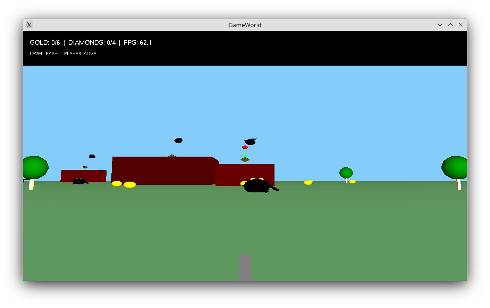
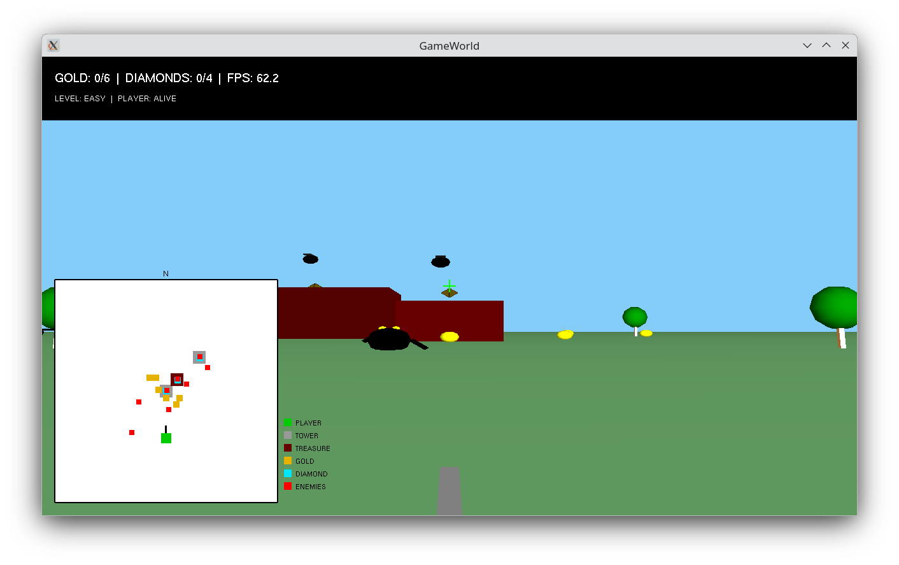
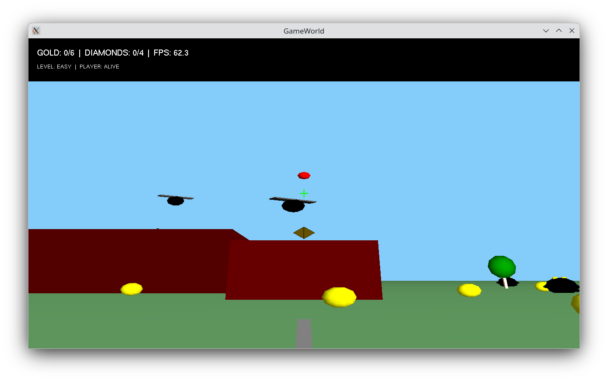
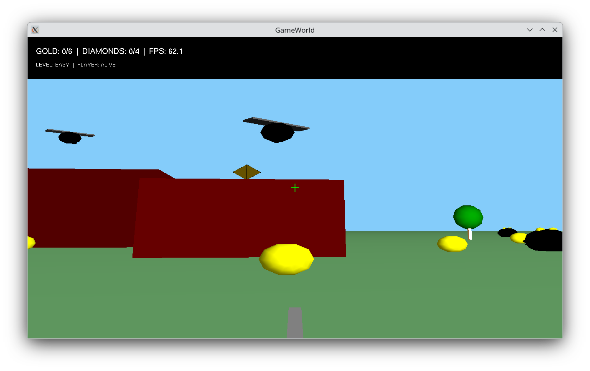
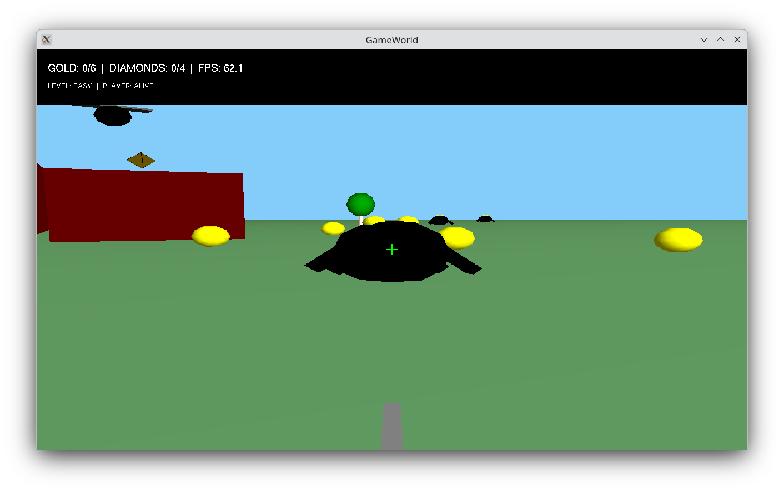
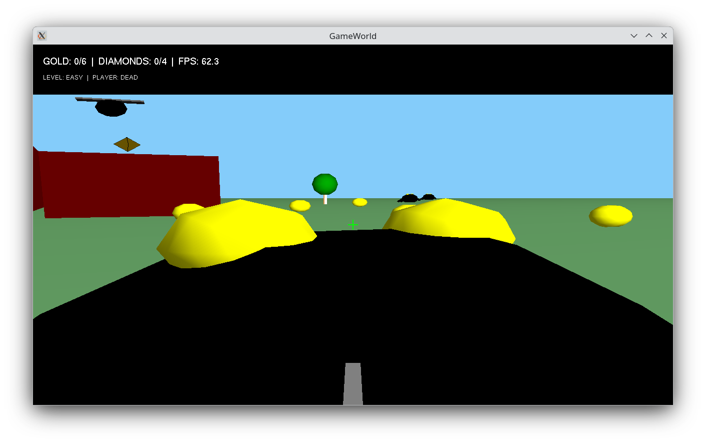
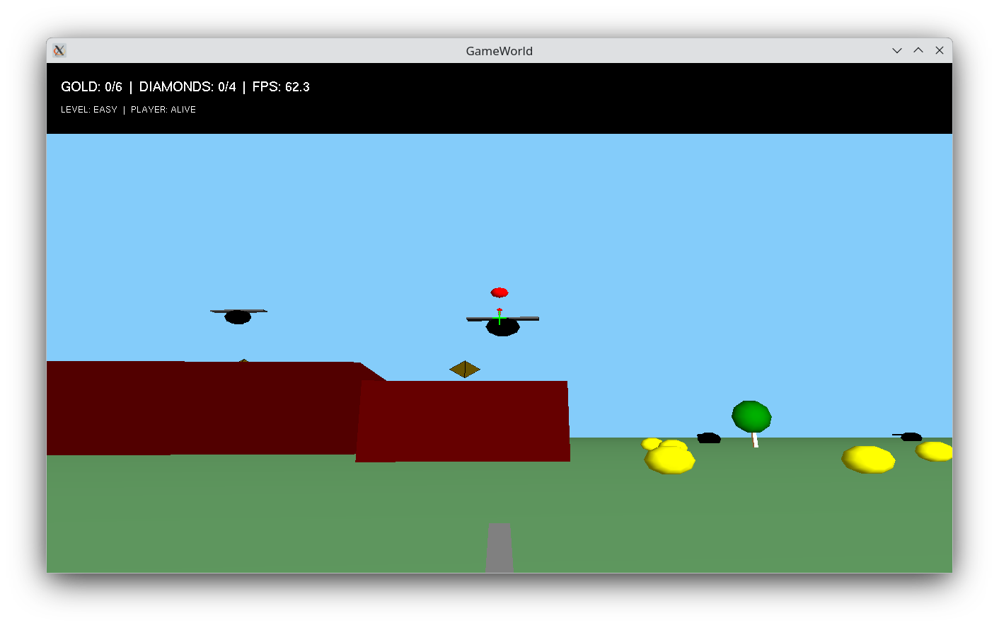
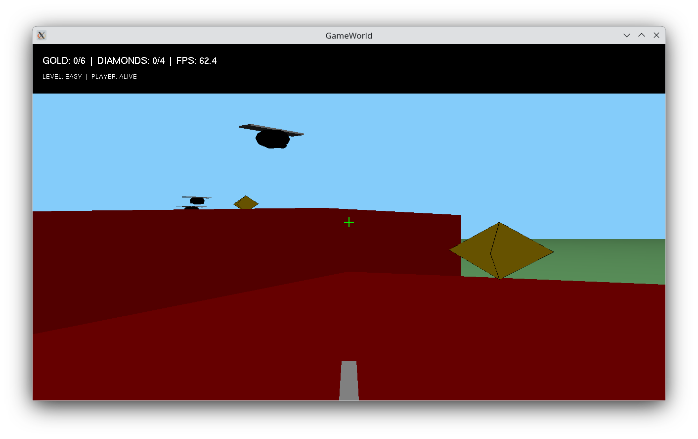
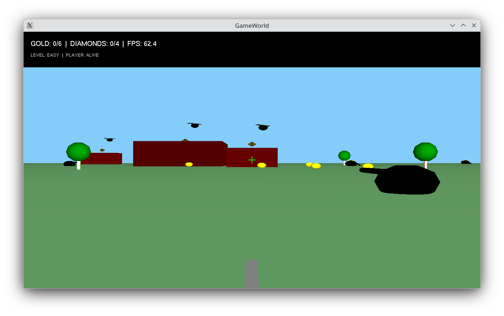
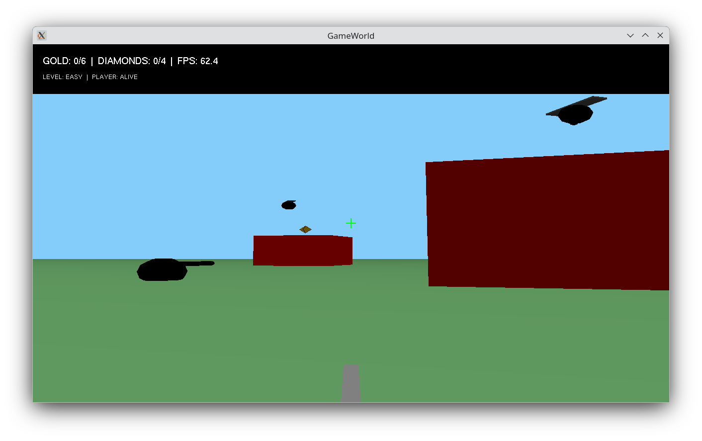

# GameWorld

**GameWorld** is a 3D world mini game for Linux. The goal is to collect gold pieces and diamonds scattered across the 3D world. Gold pieces and diamonds are protected by spiders,slimes and flying wasps. 

A screenshot of GameWorld is shown below. 



This is a low resource game and so can be played using a moderate level CPU with integrated graphics such as a Raspberry Pi 5. It has been created using C++ and OpenGL.

## How to Play

The game is played from a first-person perspective. The player experiences the action directly through the eyes of the main character. The player can move around the 3D world and shoot spiders and slimes which attack to protect gold pieces and diamonds. A game level is completed when all the gold pieces and diamonds are collected. 

| Control | Action |
| :--- | :--- |
| **WASD** or **Arrow Keys** | Move the player around 3D world. |
| **L** | Cycle through EASY → MEDIUM → HARD difficulty level. |
| **U** | Weapon up (increase pitch angle). |
| **I** | Weapon down (decrease pitch angle). |
| **Spacebar** | Shoot. |
| **R** | Rotate 90 degrees. |
| **T** | Tower (jump to tower top). |
| **G** | Ground (jump to ground level from tower). |
| **O** | Teleport to start position. |
| **M** | Map  (game map on/off). |
| **Z** | Audio (on/off). |
| **X** | Reset the game. |
| **ESC** | Exit the game|

## Installation & Building

This mini game is built for Linux using **OpenGL** which needs to be installed to play the game.

## Pre-built Binaries

Pre-built binary executables of GameWorld for x86 Debian distributions and Raspberry Pi 5 are available and can be downloaded from the binary directory. 

You need to install the OpenGL prerequisites and give the game executable permission. To do this and run GameWorld from the terminal use the commands below.

```
sudo apt install freeglut3-dev
chmod +x gameworld
./gameworld
```

## Game Map

A game map showing the position of towers, gold pieces, diamonds and enemies can be toggled on and off using the "M" (map) Key.




## Game Play Screenshots










## Build From Source (Debian, Raspberry Pi OS)

The source code is found in the src directory and is released with a GPL 3.0 license.

The instructions below show how to build and run the game from source using Debian-based distributions which have OpenGL and freeglut in their repositories. GameWorld is being developed and tested using Debian 13 Trixie.

You need to install the build and  C compiler packages.

```
sudo apt-get update
sudo apt install build-essential
sudo apt install pkg-config
```
Then install openGL packages needed for C++ compilation.
```
sudo apt install freeglut3-dev
```
The file glu.h is installed as part of freeglut3-dev. 

To check that OpenGL is installed run the following commands.
```
sudo apt install mesa-utils
glxinfo | grep OpenGL
```

Use the MAKEFILE to compile the game 

```
make
```

To run game from the terminal use

```
./gameworld
```

Make clean is also supported.

```
make clean
```

## Build from source (Fedora)

Building the game on Fedora requires installing the following packages.

```
sudo dnf install gcc-c++ make
sudo dnf install freeglut freeglut-devel
sudo dnf install geany
```
### Desktop

To install GameWorld to the local menu system create .desktop" file  called ***gameworld.desktop***  and copy this into in the ***~/.local/share/applications/***  directory. If the applications directory does not exist create it. 

A desktop file has a .desktop extension and provides metadata about an application such as its name, icon, command to execute and other properties. A "gameworld.desktop" file is shown below. You need to modify this by using your own user name and directory locations. In this example it is assumed that the GameWorld game binary is located in the directory called "gameworld" within a folder named "Software" for storing local user applications (some people use "Programs" rather than "Software"). The Exec variable defines the command to execute when launching an application, in this case, the "gameworld" binary executable.  In a **.desktop** file, you need to use absolute and full paths.

```
[Desktop Entry]
Version=0.2.0
Type=Application
Name=GameWorld
Comment=3D world mini game
Icon=/home/your_user_name/Software/gameworld/gameworld.png
Exec=/home/your-user-name/Software/gameworld/gameworld
Path=/home/your-user-name/Software/gameworld
Terminal=false
Categories=Game;
StartupNotify=true
Name[en_GB]=GameWorld
```

## Version Control

[SemVer](http://semver.org/) is used for version control. The version number has the form 0.0.0 representing major, minor and bug fix changes.

The code will be updated as and when I find bugs or make improvement to the code base.

## Author

* **Alan Crispin** [Github](https://github.com/crispinprojects)

## Project Status

Active.

## Acknowledgements

* [Debian](https://www.debian.org/)
